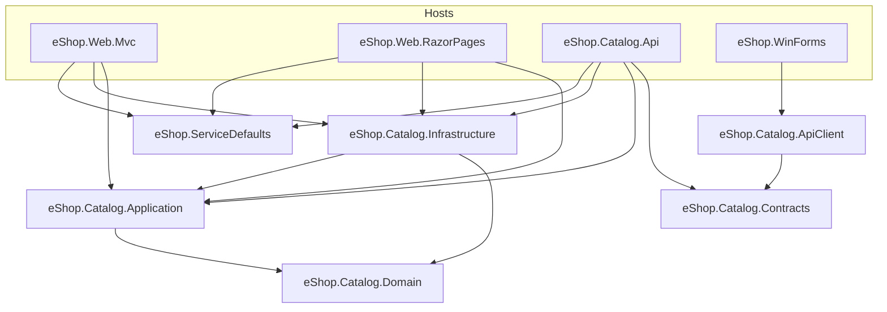

# .NET 8 Target Solution Layout

Target layout for porting the eShopModernizing apps (MVC, WebForms, WCF + WinForms) to a
single .NET 8 solution: projects, dependency direction, where the shared domain code lands,
and the order in which to move things.

This is a design document. Nothing described here exists yet except where it says
"exists today".

## 1. Starting point (what is on `main` today)

| Folder | Project | TFM | Role |
|---|---|---|---|
| `eShopLegacyMVCSolution/src/eShopLegacyMVC` | eShopLegacyMVC | net472 (packages.config-style csproj) | Original MVC 5 + Web API 2 catalog app |
| `eShopLegacyMVCSolution/eShopPorted` | eShopPorted | net461 (SDK-style) | Earlier partial port attempt (EF Core + Autofac on netfx) |
| `eShopLegacyMVCSolution/eShopLegacy.Utilities` | eShopLegacy.Utilities | v4.6.1 | One class, `Serializing` (BinaryFormatter), used by `FilesController` |
| `eShopModernizedMVCSolution/src/eShopModernizedMVC` | eShopModernizedMVC | netfx | MVC 5 + Azure (Blob, KeyVault, AAD/OWIN, App Insights) |
| `eShopLegacyWebFormsSolution/src/eShopLegacyWebForms` | eShopLegacyWebForms | netfx | WebForms catalog app |
| `eShopModernizedWebFormsSolution/src/eShopModernizedWebForms` | eShopModernizedWebForms | netfx | WebForms + Azure |
| `eShopLegacyNTier/src/eShopWCFService` | eShopWCFService | v4.6.1 | WCF `ICatalogService` (10 operations incl. stock + discount) |
| `eShopLegacyNTier/src/eShopWinForms` | eShopWinForms | v4.7 | WinForms client of the WCF service |
| `eShopModernizedNTier/src/eShopCoreAPI` | eShopCoreAPI | net8.0 | REST replacement for part of the WCF surface (items/brands/types CRUD) |
| `eShopModernizedNTier/src/eShopWinForms` | eShopWinForms | net6.0-windows | WinForms on .NET 6, still WCF client (`System.ServiceModel.*`) |
| `eShopModernized/src/eShopCoreModernized` | eShopModernized | net8.0 | Strangler-fig ASP.NET Core MVC host; nginx already routes `/api/*` and part of `/Catalog/*` to it |

The same catalog domain is copy-pasted into **nine** projects:

| Type | Copies |
|---|---|
| `CatalogItem`, `CatalogBrand`, `CatalogType` | LegacyMVC, eShopPorted, ModernizedMVC, LegacyWebForms, ModernizedWebForms, WCF (x2), eShopCoreAPI, eShopCoreModernized |
| `CatalogDBContext` / `EntityModel` | every web app + WCF (`EntityModel`) + eShopCoreAPI (`CatalogDbContext`) |
| `CatalogItemHiLoGenerator` | LegacyMVC, ModernizedMVC, both WebForms, ModernizedNTier WCF, eShopCoreModernized |
| `ICatalogService` / `CatalogService` / `CatalogServiceMock` | every app; three different interface shapes (sync web, async+sync core, WCF contract) |
| `PreconfiguredData`, `PaginatedItemsViewModel<T>` | every app |
| `IImageService`, `ImageAzureStorage`, `ImageMockStorage` | ModernizedMVC, ModernizedWebForms, eShopCoreModernized |
| `CatalogItemsStock`, `DiscountItem` | WCF only |

Differences between the copies matter for consolidation (section 4).

## 2. Target layout

One solution at the repo root, one `src/` and one `tests/`. The existing top-level folders stay
where they are until their decommission step (section 6).

```
eShop.sln
global.json                         # pin SDK 8.0.x (rollForward: latestFeature)
Directory.Build.props               # net8.0, Nullable=enable, ImplicitUsings, TreatWarningsAsErrors, AnalysisLevel
Directory.Packages.props            # central package management (one EF Core / Azure SDK version everywhere)
src/
  Catalog/
    eShop.Catalog.Domain/           # net8.0      entities + domain rules, no package references
    eShop.Catalog.Application/      # net8.0      use-case interfaces + services, options, no EF / ASP.NET
    eShop.Catalog.Infrastructure/   # net8.0      EF Core 8, SQL, Azure Blob, mock data, DI extensions
    eShop.Catalog.Contracts/        # net8.0      wire DTOs for the REST API (no references)
    eShop.Catalog.ApiClient/        # net8.0      typed HttpClient over Contracts
  Hosts/
    eShop.Web.Mvc/                  # net8.0      ASP.NET Core MVC     (replaces LegacyMVC + ModernizedMVC; evolves eShopCoreModernized)
    eShop.Web.RazorPages/           # net8.0      ASP.NET Core Razor Pages (replaces both WebForms apps)
    eShop.Catalog.Api/              # net8.0      REST API             (replaces WCF service; evolves eShopCoreAPI)
    eShop.WinForms/                 # net8.0-windows WinForms desktop client (REST, not WCF)
  Shared/
    eShop.ServiceDefaults/          # net8.0      host wiring: health checks, logging, App Insights, Key Vault, auth
tests/
  eShop.Catalog.Domain.Tests/
  eShop.Catalog.Application.Tests/
  eShop.Catalog.Infrastructure.Tests/   # SQL Server container (Testcontainers) for mapping/HiLo tests
  eShop.Catalog.Api.Tests/              # WebApplicationFactory + contract tests against Contracts
  eShop.Web.Mvc.Tests/                  # WebApplicationFactory route/parity tests
  eShop.Web.RazorPages.Tests/
```

### What goes in each project

**eShop.Catalog.Domain** (no dependencies)
- `CatalogItem`, `CatalogBrand`, `CatalogType`, `CatalogItemsStock`, `DiscountItem`.
- `CatalogItem.DefaultPictureName`, stock/reorder rules (`AvailableStock`, `RestockThreshold`,
  `MaxStockThreshold`, `OnReorder`) as behaviour on the entity rather than controller code.
- `PaginatedItems<T>` (renamed from `PaginatedItemsViewModel<T>`; it is a paging result, not a view model).
- `System.ComponentModel.DataAnnotations` attributes stay on the entities for the first port
  (they are BCL, not ASP.NET, and the MVC/WebForms views rely on `[Display]`/`[Range]`).
  Moving them to view models is a later cleanup, not a migration step.

**eShop.Catalog.Application** (-> Domain)
- `ICatalogService`: **async-only** (`FindCatalogItemAsync`, `GetCatalogItemsPaginatedAsync`,
  `GetCatalogBrandsAsync`, `GetCatalogTypesAsync`, `Create/Update/RemoveCatalogItemAsync`).
  The sync duplicates on `eShopCoreModernized.Services.ICatalogService` are dropped.
- `IInventoryService`: the WCF-only operations (`GetAvailableStockAsync`, `CreateAvailableStockAsync`,
  `GetDiscountAsync`, `GetCatalogItemsAsync(brandId, typeId)` filter).
- `IImageService` with a transport-neutral signature (`Stream` + file name instead of `IFormFile`),
  so Application does not reference ASP.NET Core.
- `CatalogOptions` (bound via `IOptions<T>`) replacing `ICatalogConfiguration` / `CatalogConfiguration`
  (`UseMockData`, `UseAzureStorage`, `UseManagedIdentity`, `UseCustomizationData`, `UseAzureActiveDirectory`, ...).

**eShop.Catalog.Infrastructure** (-> Application, Domain)
- `CatalogDbContext` (EF Core 8, SQL Server) + `IEntityTypeConfiguration<T>` classes, mapped to the
  **existing** schema: tables `Catalog`, `CatalogBrand`, `CatalogType`, sequence `catalog_hilo`.
- `InventoryDbContext` for the N-Tier `eShopDatabase` schema (`CatalogItems`, `CatalogItemsStock`,
  `DiscountItems`) until the two databases are consolidated (section 4, assumption A4).
- `CatalogItemHiLoGenerator` (one copy), `CatalogService`, `CatalogServiceMock`, `PreconfiguredData`,
  `ImageAzureStorage` (Azure.Storage.Blobs), `ImageLocalStorage` (was `ImageMockStorage`),
  `ISqlConnectionFactory` + managed-identity implementation.
- `AddCatalogInfrastructure(this IServiceCollection, IConfiguration)` that makes the
  mock / real / Azure-storage choices currently duplicated in `Program.cs` and the Autofac `ApplicationModule`s.

**eShop.Catalog.Contracts** (no dependencies)
- REST DTOs: `CatalogItemDto`, `CatalogBrandDto`, `CatalogTypeDto`, `PagedResult<T>`, `StockDto`, `DiscountDto`.
- Deliberately does **not** reference Domain, so the wire format cannot drift when entities change,
  and the WinForms client never sees EF-shaped types.

**eShop.Catalog.ApiClient** (-> Contracts)
- Typed `HttpClient` (`ICatalogApiClient`) used by WinForms (and by anything else that talks to the API).

**eShop.ServiceDefaults** (FrameworkReference `Microsoft.AspNetCore.App`; no project references)
- `AddServiceDefaults()`: health checks (`/health`, `/health/detailed`, SQL Server check),
  Application Insights, Key Vault configuration source, structured logging, forwarded headers
  (needed behind the nginx strangler proxy), optional Entra ID auth.

**Hosts** are composition roots only. Each `Program.cs` calls `AddServiceDefaults()` +
`AddCatalogInfrastructure()` and maps its own endpoints / controllers / pages.

## 3. Dependency direction



Rules (enforce with an architecture test in `eShop.Catalog.Application.Tests`, e.g. NetArchTest,
or by simply not adding the references):

1. **Domain references nothing.** No EF Core, no ASP.NET Core, no Azure SDK.
2. **Application references only Domain.** No `Microsoft.EntityFrameworkCore`, no `Microsoft.AspNetCore.*`.
3. **Infrastructure references Application + Domain**, never a host.
4. **Hosts reference Application for interfaces and Infrastructure only for the
   `AddCatalogInfrastructure()` call.** Controllers / page models depend on `ICatalogService`,
   never on `CatalogDbContext`. (Today `CatalogController` in every web app is fine; the
   `Program.cs` `EnsureCreated()` call and the WCF `EntityModel` usage are the violations to remove.)
5. **Contracts references nothing; Domain never references Contracts.** Mapping Domain <-> DTO
   lives in `eShop.Catalog.Api`.
6. **WinForms references only ApiClient (-> Contracts).** No EF, no Domain, no WCF.
   (Today both WinForms projects reference the `EntityFramework` package and a WCF connected service.)
7. No host references another host.

## 4. Where the shared domain code lands (reconciling the copies)

| Concern | Today | Target |
|---|---|---|
| Entities | 7+ copies, namespaces `eShopLegacyMVC.Models`, `eShopCoreModernized.Models`, `eShopCoreAPI.Models`, `eShopWCFService.Models`, ... | `eShop.Catalog.Domain` (namespace `eShop.Catalog.Domain`) |
| `CatalogItem` nullability | `eShopCoreModernized`: `Description`/`PictureUri` nullable; `eShopCoreAPI`: non-null `string.Empty` defaults | Nullable where the column is nullable (`Description`, `PictureUri`); `Name`, `PictureFileName` required |
| `PictureUri` | On entity, `Ignore()`d by EF | Removed from entity; computed by `IImageService.BuildUrlImage` into view models / DTOs |
| `TempImageName` | On entity in `eShopCoreModernized` + `eShopCoreAPI` (upload UI state) | Moved to the MVC/RazorPages edit view models; not persisted |
| WCF `CatalogItem` | `Picturefilename` (lower-case f), no stock fields, `money` price, `[DataContract]` | Same Domain `CatalogItem`; the `eShopDatabase` column names are handled by `InventoryDbContext` mapping; `[DataContract]` dropped (REST DTOs replace it) |
| `CatalogItemsStock`, `DiscountItem` | WCF only, EF6 attributes (`[Table]`, `[Column(TypeName="date")]`) | Domain entities without EF attributes; mapping in `InventoryDbContext` configuration classes |
| `CatalogDBContext` | EF6 (`DbModelBuilder`) in netfx apps, EF Core in `eShopCoreModernized`/`eShopCoreAPI` | One `CatalogDbContext` (EF Core 8) in Infrastructure, configuration ported from `eShopCoreModernized/Models/CatalogDBContext.cs` |
| HiLo ids | Hand-rolled `CatalogItemHiLoGenerator` using `catalog_hilo` (INCREMENT BY 10) | Keep the single hand-rolled generator first (bit-for-bit id compatibility while legacy and new apps write concurrently). Evaluate EF Core `UseHiLo("catalog_hilo")` only after legacy writers are gone, behind an integration test that asserts no id overlap |
| DB initialisation | `CatalogDBInitializer` (EF6) / `EnsureCreated()` at startup | No schema creation in production hosts. Dev/test seeding via `PreconfiguredData` in Infrastructure, invoked explicitly |
| `ICatalogService` | 3 shapes (sync web, async+sync core, WCF contract) | `ICatalogService` + `IInventoryService`, async-only, in Application |
| Config | `ICatalogConfiguration` + `CatalogConfiguration` + `Web.config` appSettings | `CatalogOptions` in Application, bound from `appsettings.json` / Key Vault |
| Image storage | 3 copies of `ImageAzureStorage`/`ImageMockStorage`, netfx ones use `HttpContext.Current.Server.MapPath` | One implementation each in Infrastructure; local storage root injected via options (no `HttpContext`) |
| `eShopLegacy.Utilities.Serializing` | BinaryFormatter, used only by `FilesController` (`/api/files`) | **Deleted.** BinaryFormatter is obsolete-as-error on .NET 8. `/api/files` returns JSON (as `eShopCoreModernized` already does). This is a wire-format break for any consumer of `/api/files` |
| `eShopPorted` | Half-port on net461 | Not carried forward; `eShopCoreModernized` supersedes it |

## 5. Mapping existing projects to target projects

| Existing | Target | Notes |
|---|---|---|
| `eShopModernized/src/eShopCoreModernized` | `eShop.Web.Mvc` (+ its Models/Services/Infrastructure split into `eShop.Catalog.*`) | Already net8.0 and already taking `/api/*` + part of `/Catalog/*`. It is the seed of the MVC host. Its `Dockerfile` still uses `aspnet:6.0`/`sdk:6.0` images while the csproj targets net8.0; fix during the move |
| `eShopLegacyMVC`, `eShopModernizedMVC` | `eShop.Web.Mvc` | Views ported into the MVC host; Autofac -> built-in DI; OWIN/AAD -> `Microsoft.Identity.Web`; `Global.asax` session writes -> middleware |
| `eShopLegacyWebForms`, `eShopModernizedWebForms` | `eShop.Web.RazorPages` | Each `.aspx` + code-behind -> a Razor Page + `PageModel`; `PicUploader.asmx` -> minimal API endpoint |
| `eShopLegacyNTier/eShopWCFService`, `eShopModernizedNTier/eShopWCFService` | `eShop.Catalog.Api` | All 10 WCF operations get REST equivalents |
| `eShopModernizedNTier/src/eShopCoreAPI` | `eShop.Catalog.Api` | Existing `api/catalog/items|brands|types` routes kept as-is |
| `eShopLegacyNTier/eShopWinForms`, `eShopModernizedNTier/eShopWinForms` | `eShop.WinForms` | Retarget to net8.0-windows; WCF proxy -> `ICatalogApiClient` |
| `eShopLegacy.Utilities`, `eShopPorted`, `ServiceFabric/` | (none) | Removed at decommission |

## 6. Migration order

Each step is independently shippable, keeps the nginx strangler proxy in front, and leaves the
legacy apps running against the same database until their decommission step.

| # | Step | Depends on | Exit criteria |
|---|---|---|---|
| 0 | **Scaffold**: `eShop.sln`, `global.json`, `Directory.Build.props`, `Directory.Packages.props`, empty projects + test projects, CI job that runs `dotnet build` / `dotnet test` on Linux | - | Empty solution builds and tests run in CI |
| 1 | **Domain + Contracts**: move entities (section 4), `PaginatedItems<T>`, DTOs. Add characterisation tests for validation rules and paging maths ported from current behaviour | 0 | Domain tests green; Domain/Contracts have zero package refs |
| 2 | **Application**: async `ICatalogService`, `IInventoryService`, `IImageService`, `CatalogOptions`; architecture test enforcing section 3 rules | 1 | Application tests green with in-memory fakes |
| 3 | **Infrastructure**: `CatalogDbContext` + `InventoryDbContext` against the existing schemas, single HiLo generator, `CatalogService`, mock service, image storage, `AddCatalogInfrastructure()`. Integration tests against SQL Server in a container, including "legacy EF6 and new EF Core allocate non-overlapping HiLo ids" | 2 | Integration tests green against a copy of the real schema; no migrations applied to the shared DB |
| 4 | **ServiceDefaults**: lift health checks, App Insights, Key Vault, forwarded headers, auth wiring out of `eShopCoreModernized/Program.cs` | 0 | Used by at least one host |
| 5 | **Re-home `eShopCoreModernized` as `eShop.Web.Mvc`** on top of steps 1-4. No new features; same routes. Move to `aspnet:8.0` image. Point nginx `core_backend` at it | 3, 4 | Route-parity tests green; existing canary routes (`/api/*`, `/Catalog/*`) served by the new host with no error-rate change |
| 6 | **Finish MVC cutover**: port remaining MVC 5 views/actions (create/edit/delete, `items/{id}/pic`, account/AAD); raise `/Catalog/*` split 25% -> 100% using the existing `nginx-*percent.conf` files; then route `/` | 5 | 100% of MVC traffic on .NET 8; legacy MVC apps idle |
| 7 | **`eShop.Catalog.Api` replaces WCF**: fold `eShopCoreAPI` in, add stock/discount/filter endpoints backed by `InventoryDbContext` | 3, 4 | Contract tests cover every former WCF operation; WCF still running for old clients |
| 8 | **WinForms on .NET 8**: retarget to net8.0-windows, replace WCF proxy with `eShop.Catalog.ApiClient`, drop `EntityFramework` package | 7 | Desktop client works end-to-end against the API; WCF endpoint has no callers |
| 9 | **WebForms -> `eShop.Web.RazorPages`**: page-by-page port (Default/list, Details, Create, Edit, Delete, pic upload); route WebForms paths via nginx as each page lands | 3, 4 | All WebForms pages served by Razor Pages; WebForms apps idle |
| 10 | **Decommission**: delete legacy/modernized-netfx project folders, `eShopPorted`, `eShopLegacy.Utilities`, `ServiceFabric/`, Windows-container deployment assets; collapse nginx config; consolidate the two databases if A4 is accepted | 6, 8, 9 | Only `eShop.sln` remains; one database |

Why this order:
- **Shared libraries first (1-4)** because every host needs them and they are pure moves with
  no user-visible change; they are also where the nine-way duplication is removed.
- **MVC before API/WinForms/WebForms (5-6)** because `eShopCoreModernized` is already on .NET 8
  and already receiving production traffic via nginx; re-homing it proves the shared projects
  under real load with the smallest code delta.
- **API before WinForms (7 before 8)** because the desktop client can only drop WCF once the REST
  surface covers stock/discount, which `eShopCoreAPI` does not today.
- **WebForms last (9)** because there is no in-place upgrade path: every page is a rewrite
  into Razor Pages, so it benefits most from stable shared libraries and a proven cutover process.

## 7. Assumptions

- **A1** The goal is one .NET 8 solution for the product, not preserving the repo's role as a
  side-by-side "legacy vs modernized" sample. Both netfx "modernized" variants (Azure-enabled)
  define the feature set to reach; the "legacy" variants are functional subsets.
- **A2** MVC and WebForms stay as two separate hosts (`eShop.Web.Mvc`, `eShop.Web.RazorPages`) so
  they can be cut over independently behind nginx. Merging them into one host is a reasonable
  follow-up once both are on .NET 8, but is not required by the port.
- **A3** Linux containers are the deployment target for all .NET 8 hosts (the WinForms client
  stays Windows-only). Windows-container assets under `ACI/`, `VM/`, `Kubernetes-DockerForWindows/`,
  `ServiceFabric/` are not ported.
- **A4** The N-Tier `eShopDatabase` and the web apps' `Microsoft.eShopOnContainers.Services.CatalogDb`
  remain separate databases during the migration (two DbContexts). Consolidating them is
  proposed for step 10 but needs a data-owner decision.
- **A5** The shared SQL schema is frozen during the migration: no EF Core migrations are applied
  to the shared database while EF6 apps are still writing to it.
- **A6** `/api/files` moving from BinaryFormatter to JSON is acceptable; no known external consumer
  depends on the binary payload.
- **A7** Naming uses an `eShop.` prefix and `Catalog` bounded-context folder; rename freely, the
  dependency rules are what matter.
